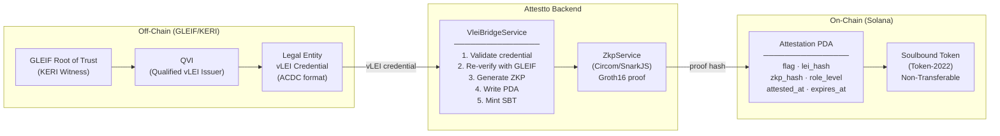
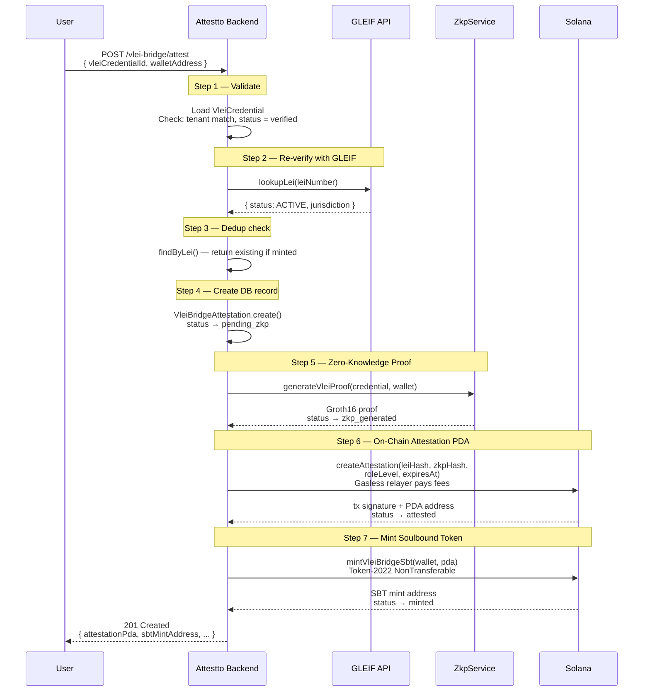
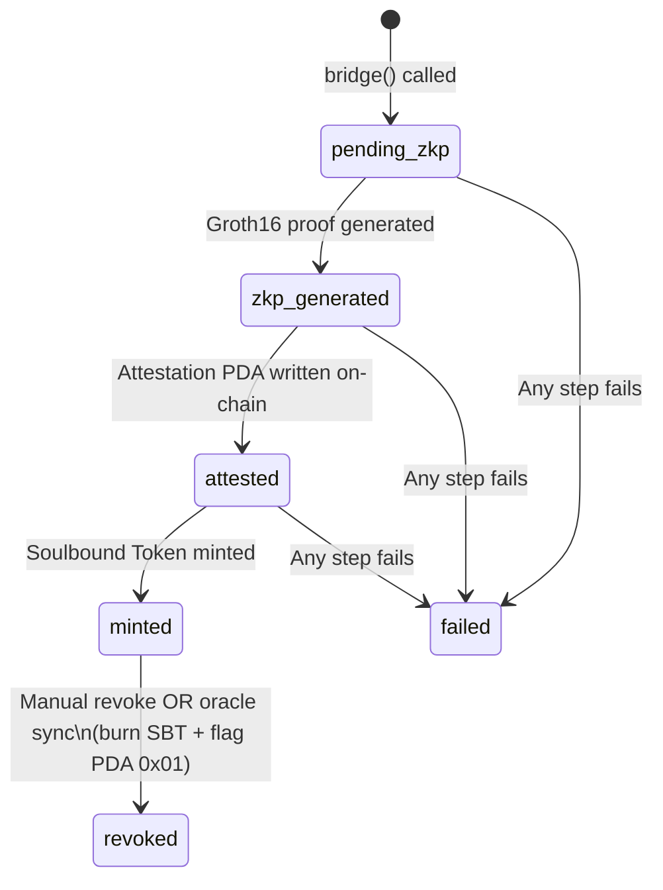
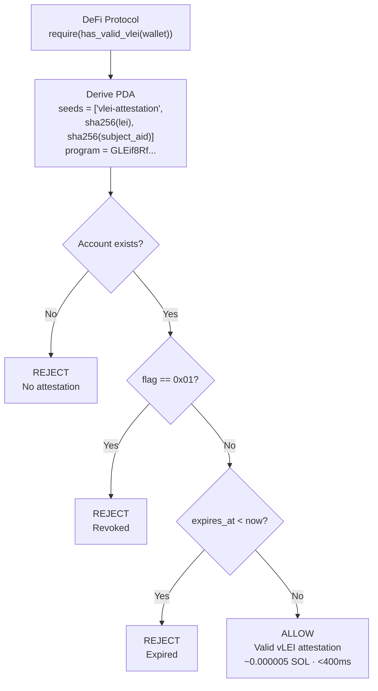
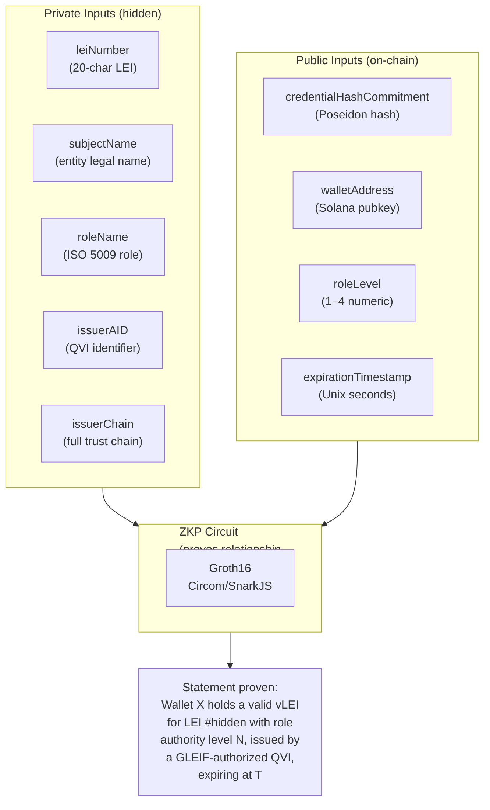
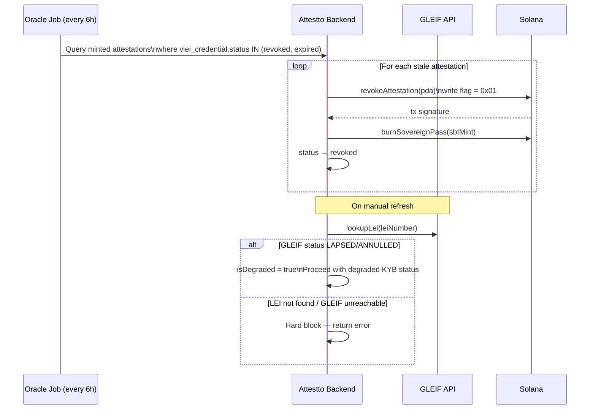
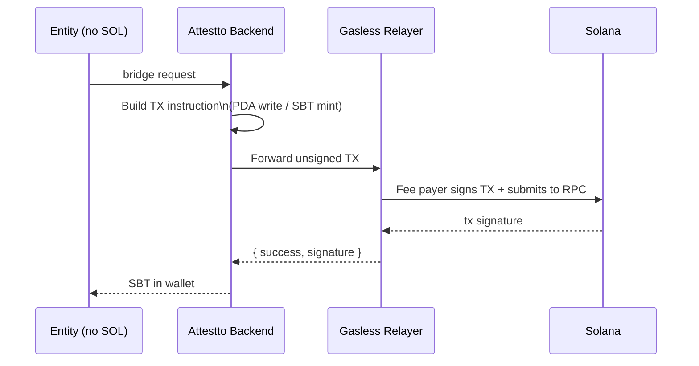

# vLEI Solana Bridge

> [!IMPORTANT]
> Institutional DeFi and compliance-gated applications need to verify the legal identity of corporate participants — who they are, what role they hold, and whether that identity is current. Today, this either requires trusting a centralized oracle or exposing sensitive corporate data on-chain.

## Program

| | |
|---|---|
| **Program ID (Mainnet)** | [`GLEif8Rf1NFiuGPXxD7n3sakuNH6SZPFfoZMg1pBVEFm`](https://solana.fm/address/GLEif8Rf1NFiuGPXxD7n3sakuNH6SZPFfoZMg1pBVEFm) |
| **Upgrade Authority** | [`J9vNVyywjig2ZGMnyxJCgdT14YWPExEKvz7ZURVjuZjv`](https://solana.fm/address/J9vNVyywjig2ZGMnyxJCgdT14YWPExEKvz7ZURVjuZjv) (Squads multisig) |
| **Network** | Solana Mainnet-Beta |
| **Framework** | Anchor 0.32.1 |
| **License** | Apache-2.0 |

---

## Executive Overview

### The Problem

Institutional DeFi and compliance-gated applications need to verify the legal identity of corporate participants — who they are, what role they hold, and whether that identity is current. Today, this either requires trusting a centralized oracle or exposing sensitive corporate data on-chain.

### What This Does

The vLEI Solana Bridge takes a [GLEIF](https://www.gleif.org/)-issued verifiable LEI credential (the global standard for legal entity identity, used by 2.4M+ entities worldwide) and produces two on-chain artifacts:

1. **Attestation PDA** — a program-derived account storing a ZKP proof hash, role level, expiry, and revocation flag. No PII. Any Solana program can read it in a single account lookup.
2. **Soulbound Token (SBT)** — a non-transferable Token-2022 NFT bound to the entity's wallet, readable in any wallet UI.

A Groth16 Zero-Knowledge Proof proves the credential is valid, non-expired, and held by the submitting wallet — without revealing the entity name, LEI number, or any identifying data.

> [!NOTE]
> No PII is ever stored on-chain. Only ZKP proof hashes, role levels, and timestamps reach the Solana ledger.

### Who Uses It

- **DeFi protocols** — gate liquidity pools, lending markets, or governance votes to verified institutional participants via a single `has_valid_vlei()` PDA read
- **Compliance platforms** — replace manual KYB checks with cryptographically verifiable, GLEIF-anchored identity
- **Institutional wallets** — display a verifiable badge of corporate identity alongside token balances

### Regulatory Alignment

| Standard | Coverage |
|---|---|
| **GLEIF vLEI (ACDC/KERI)** | Full credential chain-of-trust validation back to GLEIF Root of Trust |
| **EU MiCA** | Verifiable corporate identity for institutional DeFi access |
| **FATF Travel Rule** | Originator/beneficiary identification for cross-border virtual asset transfers |
| **ISO 5009** | Role-level mapping from vLEI roles to on-chain numeric authority levels (1–4) |

---

## Architecture

### Three-Layer Model



### Key Properties

> [!TIP]
> **Permissionless verification** — any Solana program reads the PDA with a single account lookup (~0.000005 SOL, <400ms). No SDK required, no oracle dependency.

- **Soulbound** — non-transferable PDAs and Token-2022 NFTs bound to a specific LEI + credential subject
- **Revocable** — on-chain flag flipped instantly; oracle syncs GLEIF revocations every 6 hours
- **Privacy-preserving** — vLEI credential never touches the chain; only ZKP proof hash, role level, and timestamps stored
- **Gasless** — entities never need SOL; Attestto sponsors all transaction fees via a dedicated fee-payer wallet

---

## Bridge Flow

### Full Mint Sequence



### State Machine



---

## On-Chain Verification

### DeFi Protocol Integration



### One-Line Check (Rust/Anchor)

```rust
require!(attestto_sbt.has_valid_vlei(user_wallet))
```

---

## ZKP Circuit

The Groth16 circuit (`vlei_verification.circom`) enforces 5 constraints:

1. **Credential hash** — Poseidon commitment matches the credential
2. **Expiry** — credential is not expired at attestation time
3. **Non-revocation** — credential is not revoked
4. **Role level** — credential holder meets minimum role level
5. **Wallet binding** — proof is bound to the submitting wallet

### What the ZKP Proves (Without Revealing)



---

## Role Level Mapping (ISO 5009)

| vLEI Role | Level | On-Chain Permissions |
|---|---|---|
| BO · DIR · SEC · TRE | 1 | Read attestations, view compliance status |
| CO · AO | 2 | Sign compliance docs, approve transfers |
| CFO · COO · CTO · CISO · LR · BD | 3 | Approve KYB, sign regulatory reports |
| CEO | 4 | Full authority: governance votes, multisig admin |

---

## Instructions

### `create_attestation`

Creates a new attestation PDA after verifying the Groth16 ZKP on-chain.

**PDA seeds**: `['vlei-attestation', lei_hash, subject_aid]`

| Argument | Type | Description |
|---|---|---|
| `lei_hash` | `[u8; 32]` | SHA-256 of the 20-character LEI number |
| `subject_aid` | `[u8; 32]` | SHA-256 of the KERI AID (prevents same-LEI collisions) |
| `proof_a` | `[u8; 64]` | Groth16 proof point A (G1) |
| `proof_b` | `[u8; 128]` | Groth16 proof point B (G2) |
| `proof_c` | `[u8; 64]` | Groth16 proof point C (G1) |
| `public_signals` | `[[u8; 32]; 4]` | ZKP public inputs: timestamp, credential hash, wallet hash, role level |
| `attested_at` | `i64` | Unix timestamp of attestation creation |
| `expires_at` | `i64` | Unix timestamp of attestation expiry |
| `metadata_uri` | `String` | Off-chain metadata URI (max 2048 bytes) |

### `revoke_attestation`

Revokes an existing attestation by setting `flag = 0x01`. Only the original authority can revoke.

### `set_pq_identity_root`

Stores a 64-byte post-quantum identity root hash (SHA-512/SHAKE-256 of ML-DSA-65 public key) on an active attestation. Enables future PQ verification without storing the full 1312-byte key on-chain.

---

## Account Layout

```
VleiAttestation (353 + metadata_uri bytes)

 Byte Offset    Size     Field               Description
 ===========    ====     =====               ===========
 0              8        discriminator       Anchor 8-byte account discriminator
 8              1        flag                0x00 = active, 0x01 = revoked
 9              32       lei_hash            SHA-256 of LEI number
 41             32       subject_aid         SHA-256 of KERI AID (credential subject)
 73             32       zkp_proof_hash      SHA-256 of Groth16 proof (proof_a||b||c)
 105            128      public_signals      4 x 32-byte ZKP public inputs (audit)
 233            8        attested_at         Unix timestamp (LE int64)
 241            8        expires_at          Unix timestamp (LE int64)
 249            2        metadata_uri_len    Length of metadata URI (LE uint16)
 251            4+N      metadata_uri        Borsh String (4-byte len prefix + UTF-8)
 255+N          32       authority           Pubkey of fee payer (Attestto backend)
 287+N          1        bump                PDA bump seed
 288+N          1        pq_identity_root_set  Whether PQ root has been set
 289+N          64       pq_identity_root    SHA-512 hash of ML-DSA-65 public key

 Total: 8 + 353 + N bytes (N = metadata URI length, max 2048)

 Privacy: NO entity name, NO jurisdiction, NO PII stored on-chain.
          Only hashes, timestamps, and ZKP public signals.
```

---

## Revocation

### Manual & Oracle Revocation



### Refresh (Re-Attestation)

```
POST /vlei-bridge/attestations/:id/refresh

1. Load existing attestation
2. Re-verify LEI with GLEIF API
   |
   +-- LAPSED/ANNULLED → isDegraded = true, proceed (degraded KYB status)
   +-- Not found / unreachable → hard block, return error
   +-- ACTIVE → proceed normally
3. Revoke old attestation (PDA + DB)
4. Run full bridge() again: new ZKP → new PDA → new SBT
5. Return new attestation
```

---

## Gasless Transaction Relay

Entities never need to hold SOL. Attestto sponsors all on-chain transaction fees via a dedicated fee-payer wallet.



---

## SAS (Solana Attestation Service) Integration

After the custom Attestto PDA and SBT are written, the bridge optionally mirrors the attestation to the ecosystem-wide [Solana Attestation Service](https://github.com/solana-foundation/solana-attestation-service) (SAS) for ecosystem discoverability.

| | |
|---|---|
| **SAS Program ID** | `22zoJMtdu4tQc2PzL74ZUT7FrwgB1Udec8DdW4yw4BdG` |
| **SDK** | `sas-lib` (npm) — uses `@solana/kit` (Web3.js v2) |
| **Attestation Type** | Tokenized — mints a soulbound Token-2022 NFT to the recipient |

> [!NOTE]
> Both attestations coexist: the custom PDA is the source of truth for ZKP verification; the SAS mirror adds ecosystem discoverability (Civic, SumSub, Range, etc.). SAS failure is **non-fatal** — the custom PDA and SBT remain valid regardless.

### SAS Schema

| Field | Type | Description |
|---|---|---|
| `lei_hash` | String | SHA-256 of 20-char LEI number |
| `subject_aid` | String | SHA-256 of KERI AID |
| `zkp_proof_hash` | String | SHA-256 of Groth16 proof |
| `role_level` | U8 | ISO 5009 authority level (1–4) |
| `jurisdiction` | String | ISO 3166-1 alpha-2 country code |
| `attested_at` | I64 | Unix timestamp of attestation |
| `expires_at` | I64 | Unix timestamp of expiry |
| `custom_pda` | String | Address of the custom attestation PDA |
| `metadata_uri` | String | Off-chain metadata JSON URI |

---

## REST API Reference

| Method | Endpoint | Description |
|---|---|---|
| `POST` | `/vlei-bridge/attest` | Full bridge flow (ZKP + PDA + SBT) |
| `GET` | `/vlei-bridge/attestations` | List attestations (paginated) |
| `GET` | `/vlei-bridge/attestations/:id` | Single attestation detail |
| `POST` | `/vlei-bridge/attestations/:id/refresh` | Re-verify + re-attest |
| `DELETE` | `/vlei-bridge/attestations/:id` | Revoke attestation |
| `GET` | `/vlei-bridge/verify/:lei` | Public LEI verification |

### POST /vlei-bridge/attest

```json
// Request
{
  "vleiCredentialId": 42,
  "walletAddress": "<entity-wallet-address>"
}

// Response (201)
{
  "id": 1,
  "leiNumber": "5493001KJTIIGC8Y1R12",
  "jurisdiction": "CR",
  "walletAddress": "...",
  "status": "minted",
  "attestationPda": "...",
  "sbtMintAddress": "...",
  "attestedAt": "2026-02-09T...",
  "expiresAt": "2027-02-09T..."
}
```

**Error codes**: `CREDENTIAL_NOT_FOUND`, `TENANT_MISMATCH`, `CREDENTIAL_INACTIVE`, `GLEIF_INVALID`, `ZKP_FAILED`, `ATTESTATION_FAILED`, `SBT_MINT_FAILED`

---

## Security

| Threat | Mitigation |
|---|---|
| PII leakage on-chain | ZKP masks all sensitive data; only hashes and timestamps stored in PDA |
| Stale credentials | Oracle job runs every 6h; GLEIF re-verified on refresh; PDA has expiry timestamp |
| Unauthorized minting | Only Attestto's fee payer can write PDAs; vLEI must be `status='verified'` in DB |
| SBT transfer | Token-2022 NonTransferable extension enforced at protocol level |
| Replay attacks | ZKP includes wallet pubkey binding; PDA keyed to specific LEI + subject AID |
| Key compromise | Revocation sync burns SBT + invalidates PDA within 6h; manual revoke is instant |
| Program upgrades | Upgrade authority controlled by Squads multisig (`J9vNVyywjig2ZGMnyxJCgdT14YWPExEKvz7ZURVjuZjv`) |

See [SECURITY.md](./SECURITY.md) for vulnerability disclosure policy.

---

## Build

### Circuit

```bash
# Install Circom compiler
git clone https://github.com/iden3/circom.git /tmp/circom
cd /tmp/circom && cargo build --release && cargo install --path circom

# Build the circuit
cd circuits
npm install          # installs circomlib, snarkjs
./build.sh           # compile + trusted setup + export vkey
```

This produces three artifacts in `circuits/build/`:
- `vlei_verification.wasm` — circuit witness generator
- `vlei_verification.zkey` — proving key (Groth16)
- `vlei_verification_vkey.json` — verification key

### Verification Key Conversion

The Anchor program embeds the verification key as a Rust `const`. After building the circuit, convert the snarkjs JSON vkey into byte arrays:

| Point type | Encoding order | Size |
|---|---|---|
| G1 | `x (32B BE) \|\| y (32B BE)` | 64 bytes |
| G2 | `x_imaginary (32B BE) \|\| x_real (32B BE) \|\| y_imaginary (32B BE) \|\| y_real (32B BE)` | 128 bytes |

> [!WARNING]
> For G2, the **imaginary** component comes **before** the real component in each pair. This matches the Ethereum/Solana `alt_bn128` precompile encoding. Getting this order wrong produces a silent verification failure.

```bash
node -e "
const vkey = require('./circuits/build/vlei_verification_vkey.json');

function bigintToBytes32BE(s) {
  let n = BigInt(s);
  const bytes = [];
  for (let i = 0; i < 32; i++) {
    bytes.unshift(Number(n & 0xFFn));
    n >>= 8n;
  }
  return bytes;
}

function g1ToBytes(pt) {
  return [...bigintToBytes32BE(pt[0]), ...bigintToBytes32BE(pt[1])];
}

function g2ToBytes(pt) {
  return [
    ...bigintToBytes32BE(pt[0][1]), ...bigintToBytes32BE(pt[0][0]),
    ...bigintToBytes32BE(pt[1][1]), ...bigintToBytes32BE(pt[1][0]),
  ];
}

console.log('vk_alpha_g1:', JSON.stringify(g1ToBytes(vkey.vk_alpha_1)));
console.log('vk_beta_g2:', JSON.stringify(g2ToBytes(vkey.vk_beta_2)));
console.log('vk_gamma_g2:', JSON.stringify(g2ToBytes(vkey.vk_gamma_2)));
console.log('vk_delta_g2:', JSON.stringify(g2ToBytes(vkey.vk_delta_2)));
vkey.IC.forEach((ic, i) => console.log('vk_ic[' + i + ']:', JSON.stringify(g1ToBytes(ic))));
"
```

### Program

```bash
# Install Anchor CLI
cargo install --git https://github.com/coral-xyz/anchor avm --force
avm install 0.32.1 && avm use 0.32.1

# Build and test
pnpm install
anchor build
anchor test
```

### Verified Build (Mainnet)

> [!CAUTION]
> The upgrade authority is controlled by the Squads multisig (`J9vNVyywjig2ZGMnyxJCgdT14YWPExEKvz7ZURVjuZjv`). Every program upgrade requires a multisig proposal — single-key deploys are not possible.

The program is verified on-chain via [OtterSec](https://verify.osec.io). To re-verify after an upgrade:

```bash
# 1. Build verifiably
solana-verify build

# 2. Export PDA transaction (Squads signs)
solana-verify export-pda-tx \
  https://github.com/Attestto-com/vLei-Solana-Bridge \
  --program-id GLEif8Rf1NFiuGPXxD7n3sakuNH6SZPFfoZMg1pBVEFm \
  --uploader J9vNVyywjig2ZGMnyxJCgdT14YWPExEKvz7ZURVjuZjv \
  --mount-path programs/attestto-vlei-sbt \
  --library-name attestto_vlei_sbt \
  --encoding base58 \
  --compute-unit-price 50000

# 3. Submit base58 output through Squads transaction builder
#    Verify simulation shows ONLY: osec verify program + compute budget

# 4. Submit remote verification
solana-verify remote submit-job \
  --program-id GLEif8Rf1NFiuGPXxD7n3sakuNH6SZPFfoZMg1pBVEFm \
  --uploader J9vNVyywjig2ZGMnyxJCgdT14YWPExEKvz7ZURVjuZjv
```

### Deploy to Devnet

```bash
solana config set --url https://api.devnet.solana.com
solana airdrop 5

anchor build
solana address -k target/deploy/attestto_vlei_sbt-keypair.json
# Update declare_id!() in lib.rs and [programs.devnet] in Anchor.toml

anchor build
anchor deploy --provider.cluster devnet
solana program show <PROGRAM_ID>
```

---

## License

Apache-2.0
